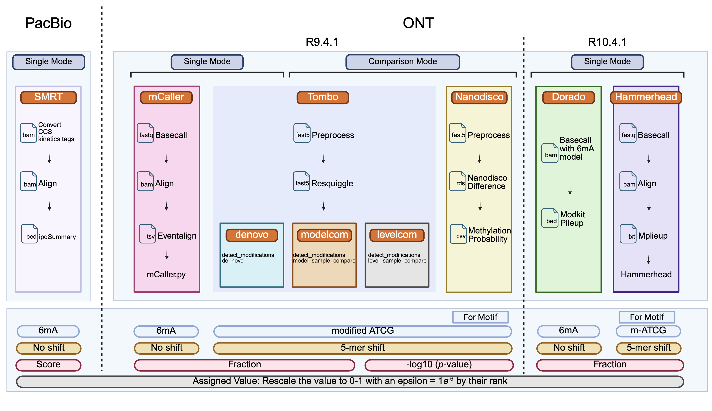

# TGS-comparison-for-bacteria-6mA

This GitHub repository contains all the custom scripts and shell commands used in our paper,

**Comprehensive Comparison of Third-Generation Sequencing Tools for Bacterial 6mA Profiling**.

## Graphic abstract

## Data available
Oxford Nanopore's basecall model is updated frequently, we recommend using the latest basecaller model for re-calling. 

All raw signal files are uploaded to NCBI (BIOPROJECT:[PRJNA1119015](https://ncbi.nlm.nih.gov/bioproject/?term=PRJNA1119015)).

All processed files are uploaded to [Zenodo](10.5281/zenodo.15165726).

Evaluation results can be found in the Source Data File.

If you have any further requests, please contact xindeng@cityu.edu.hk or beifanglu2-c@my.cityu.edu.hk. We are pleased to help!

## Code available

System requirement: Ubuntu 16.04; R version: 4.3.1.

**Notes:** We highly recommend creating a separate conda environment to manage the following software tools.

### Envs

The install time should be around 30 mins.

Mandatory software:

| Name         | Version  | Source|
|:-------------|:---------|:--------|
| **samtools** | v1.17    |conda|
| **minimap2** | v2.17    |conda|
| **python**   | \>=3.9.2 |conda|
| **nanoCEM**  | 0.0.5.8  |Pypi|
| **h5py**  | 3.8.0  |Pypi|
| **pod5**  | 0.2.4  |Pypi|
| **Samtools**  | 1.17  |conda|
| **SeqKit**  | 2.6.1  |conda|
| **ont-fast5-api**  | 4.1.1  |Pypi|
| **slow5tools**  | 1.2.0  |Pypi|
| **memes**  | 1.8.0  |R|
| **Giraffe**  | 0.1.0.14  |Pypi|

Nanopore tools:

| Name            | Version | Source|
|:----------------|:--------|:--------|
| **Tombo**       | v1.5    |conda|
| **Nanopolish**  | v1.14.1 |conda|
| **Hammerhead** | 0.1.3   |Pypi|
| **Dorado**  | 0.5.0  |conda|
| **mCaller**  | 0.0.5.8  |Pypi|

R requried softwares are listed in [R_Sessioninfo.txt](main_code/R_Sessioninfo.txt)

### main_code
#### Nanopore_tools_code
Here are all the shell commands used to obtain the bacterial 6mA predictions using all seven Nanopore tools.
For each sample, we run the commands in [QC.sh](main_code/Benchmark_code/QC.sh). The basecalled **fastq** file and the alignment result (**bam** file) with the reference can be collected,
while giraffe will help to calculate the estimated features such as Q score and read length.

Additionally, for Tombo, we developed [read_tombo.py](main_code/Nanopore_tools_code/read_tombo.py) to merge the result from `tombo text_output` and output a **bed** file.

    Usage: read_tombo.py [-h] [-t TOMBO_RESULT] [--ref REF] [--output OUTPUT]
    optional arguments:                                                      
      -h, --help            show this help message and exit                  
      -t TOMBO_RESULT, --tombo_result TOMBO_RESULT                       
                            suffix of tombo result                           
      --ref REF             reference path                                   
      --output OUTPUT       output path   

#### Benchmark
We show the main code of our work, structured in R markdown files.
In each Rmd, we recommend the reading following the **Outline**.
For example in [Psph_WT_evaluation.Rmd](main_code/Benchmark_code/Psph_WT_evaluation.Rmd). 
1. Data loading and **normalization**.
2. **Motif** discovery.
3. Sites comparsion which focused on the **single-base/5-mer** resolution
4. **Single molecule** level comparison in [Psph_single_molecule_evalutation.Rmd](main_code/Benchmark_code/Psph_single_molecule_evalutation.Rmd). 
5. **Outliers** analysis.
6. Detailed comparison of Nanopore and SMRT results.
7. Campared with [6mA-IP-seq](main_code/Benchmark_code/Psph_IPseq_annotation.Rmd).

The expecting running time for each tool's comparison should be within 60 mins.

#### figures_code
We present the codes for the figures plot in each Rmd file.

All figures'code can be found in this git version. For example:

1. Codes for plotting F1 score change curve, PRC, and ROC curve are provided.

2. Codes for plotting peaks from 6mA-IP-seq are provided.

3. Codes for plotting methylome are provided.

#### Showcase of the current
After obtaining many modification sites, 
we used [nanoCEM](https://github.com/lrslab/nanoCEM) to showcase the analysis focusing on current and alignment feature.

## Cite us
Lu, B., Guo, Z., Liu, X. et al. Comprehensive comparison of the third-generation sequencing tools for bacterial 6mA profiling. Nat Commun 16, 3982 (2025). https://doi.org/10.1038/s41467-025-59187-2

DOI: https://doi.org/10.1038/s41467-025-59187-2
